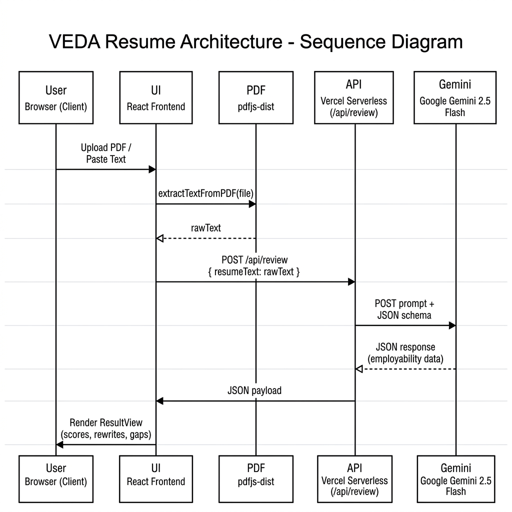
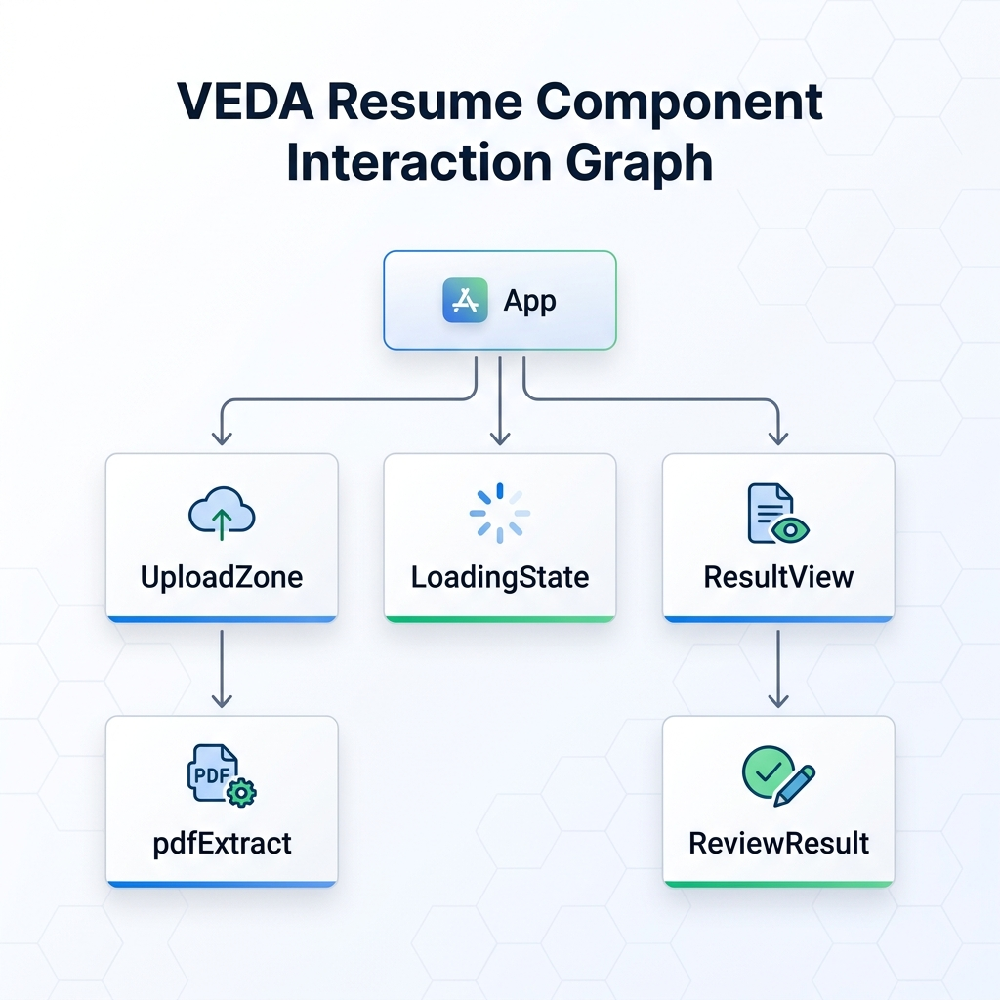

# VEDA Resume (Virtual Employability & Document Analyzer)

> **AI‑powered resume analysis for smarter careers.**

VEDA Resume is a premium, cinematic career‑intelligence platform that goes beyond simple grammar checks. It parses resume PDFs **entirely in the browser** (ensuring zero data persistence) and feeds the extracted text to **Google Gemini 2.5 Flash** to generate a structured employability report.

---

## 📚 Table of Contents

1. [Project Overview](#project-overview)
2. [Key Features](#key-features)
3. [Architecture Diagram](#architecture-diagram)
4. [Design System & UI/UX](#design-system--uiux)
5. [Technology Stack](#technology-stack)
6. [Installation & Setup](#installation--setup)
   - 6.1 [Prerequisites](#prerequisites)
   - 6.2 [Clone the Repository](#clone-the-repository)
   - 6.3 [Install Dependencies](#install-dependencies)
   - 6.4 [Configure Environment Variables](#configure-environment-variables)
   - 6.5 [Run the Development Server](#run-the-development-server)
7. [Production Build & Deployment](#production-build--deployment)
8. [API Reference (Vercel Serverless Function)](#api-reference)
9. [Component Catalog](#component-catalog)
10. [Styling Guide (Tailwind & CSS)](#styling-guide)
11. [Animations & Motion Guide](#animations--motion-guide)
12. [Testing Strategy](#testing-strategy)
13. [Performance Optimizations](#performance-optimizations)
14. [Security & Privacy Model](#security--privacy-model)
15. [Troubleshooting FAQ](#troubleshooting-faq)
16. [Contribution Guidelines](#contribution-guidelines)
17. [Roadmap & Future Enhancements](#roadmap--future-enhancements)
18. [Acknowledgements & Credits](#acknowledgements--credits)
19. [License](#license)
20. [Appendix – Full JSON Schema](#appendix---full-json-schema)
21. [Glossary of Terms](#glossary-of-terms)
22. [Change Log](#change-log)
23. [Contact & Support](#contact--support)

---

<a id="project-overview"></a>

## 📖 Project Overview

VEDA (Virtual Employability & Document Analyzer) reimagines resume reviewing as a **data‑driven, AI‑enhanced experience**. The platform is built with a **dark‑mode, high‑contrast visual language** that communicates authority while remaining friendly. The core workflow is:

1. **Upload or paste** a resume.
2. **Client‑side PDF extraction** via `pdfjs-dist`.
3. **Send raw text** to a Vercel Serverless Function.
4. **Serverless function** forwards prompt to Gemini 2.5 Flash with a strict JSON schema.
5. **Receive structured response** and render an interactive UI.

Every step respects user privacy: the PDF never leaves the browser, and the backend only sees raw text.

---

<a id="key-features"></a>

## ✨ Key Features

- **Zero‑Persist PDF Parsing** – `pdfjs-dist` runs in‑browser, no uploads.
- **Employability Metrics Matrix** – Scores for Clarity, Impact, ATS Compatibility, Structure.
- **Smart Rewrites** – Three weakest bullet points rewritten with action verbs, quantified impact.
- **Industry Fit Analyzer** – Detects target industry and provides a tailored fit score.
- **Skill Gap Detector** – Identifies missing core skills for the selected role.
- **Cinematic UI/UX** – Glassmorphism cards, gradient accents, Framer Motion micro‑interactions.
- **Full‑Stack Vercel Architecture** – Serverless API keeps the secret key safe.
- **Responsive & Accessible** – WCAG AA contrast ratios, keyboard navigation, ARIA labels.
- **Extensible Prompt Engineering** – Prompt can be swapped for other LLM providers.
- **Internationalization Ready** – Text strings externalized for future i18n.
- **Analytics Dashboard (Future)** – Planned integration with Vercel Analytics for usage metrics.
- **Exportable Report** – Future feature to download PDF/HTML version of the analysis.

---

<a id="architecture-diagram"></a>

## 🏗️ Architecture Diagram



---

<a id="design-system--uiux"></a>

## 🎨 Design System & UI/UX

### Colors & Gradients

| Purpose                 | Dark Mode                     |
| ----------------------- | ----------------------------- |
| Background              | `#0C0C0C`                     |
| Primary Text            | `#D7E2EA`                     |
| Accent Gradient (Score) | `#18011F → #B600A8 → #BE4C00` |
| VEDA Signature Gradient | `#0F172A → #1E3A8A → #0D9488` |
| Success Highlight       | `#10B981`                     |
| Warning Highlight       | `#F59E0B`                     |
| Error Highlight         | `#EF4444`                     |

### Typography

- **Font Family**: `Kanit` (Google Font)
- **Weights**: `font-black` for hero scores, `font-semibold` for headings, `font-medium` for body.
- **Letter‑spacing**: `tracking-widest` on labels, `tracking-normal` on paragraph text.

### Glassmorphism Cards

```css
.bg-glass {
  @apply bg-white/5 backdrop-blur-md border border-white/10 rounded-xl shadow-xl;
}
```

All result cards (`Metrics`, `Strengths`, `Weaknesses`, `Skill Gaps`, `Rewrites`) use this class.

### Micro‑Interactions

- **Staggered Entrances** – `staggerChildren: 0.15` on root containers.
- **Hover Scale** – `transform hover:scale-102 active:scale-98` on buttons.
- **Glow Effects** – subtle `box‑shadow` with `rgba(16,185,129,0.15)` on drag‑over.
- **Animated Progress Bars** – width animates from 0 % to target % with `duration: 0.9s`.
- **Dynamic Loading Messages** – rotating array of status strings every 1.8 s.

---

<a id="technology-stack"></a>

## 🛠️ Technology Stack

| Layer              | Technology                                       | Reason                                                  |
| ------------------ | ------------------------------------------------ | ------------------------------------------------------- |
| Frontend Framework | **React 18** + **TypeScript**                    | Strong typing, component model, ecosystem.              |
| Build Tool         | **Vite**                                         | Lightning‑fast dev server, native ES modules.           |
| Styling            | **Tailwind CSS v3** + **Vanilla CSS**            | Utility‑first styling, easy theming, small bundle size. |
| Animations         | **Framer Motion**                                | Declarative, composable motion, easy staggering.        |
| PDF Parsing        | **pdfjs‑dist**                                   | Mature PDF text extraction library, works in browsers.  |
| Backend            | **Vercel Serverless Functions** (`@vercel/node`) | No server management, secure env variables.             |
| AI Model           | **Google Gemini 2.5 Flash**                      | Low latency, high quality, schema‑enforced JSON output. |
| Icons              | **Lucide‑React**                                 | Open‑source, consistent style, easy theming.            |
| Testing            | **Jest** + **React Testing Library**             | Unit + integration testing for components and API.      |
| Linter             | **ESLint** (Airbnb) + **Prettier**               | Code consistency and auto‑formatting.                   |
| CI/CD              | **GitHub Actions**                               | Automated lint, test, and Vercel preview deployments.   |

---

<a id="installation--setup"></a>
<a id="install-dependencies"></a>

## 🚀 Installation & Setup

<a id="prerequisites"></a>

### 📦 Prerequisites

- **Node.js** ≥ 20 (recommended 20.14 LTS) – verify with `node -v`.
- **npm** ≥ 10 or **pnpm** if you prefer.
- **Git** – for cloning the repo.
- **Vercel CLI** – required to run the serverless backend locally.

<a id="clone-the-repository"></a>

### 📂 Clone the Repository

```bash
git clone https://github.com/webdeveloperdesigner/veda-resume.git
cd veda-resume
```

### 📦 Install Dependencies

```bash
npm ci   # installs exact versions from package-lock.json
```

<a id="configure-environment-variables"></a>

### 🔐 Configure Environment Variables

Create a `.env` file in the project root:

```env
GEMINI_API_KEY=YOUR_GEMINI_API_KEY_HERE
```

> **Important**: Do not commit this file. It is automatically ignored via `.gitignore`.

<a id="run-the-development-server"></a>

### ⚡ Run the Development Server

```bash
# Install Vercel CLI globally if you haven't already
npm i -g vercel

# Link the project (choose "No" if you don't have a remote Vercel project yet)
vercel link

# Start the full‑stack dev server
vercel dev
```

The app will be available at `http://localhost:3000`.

---

<a id="production-build--deployment"></a>

## 📦 Production Build & Deployment

1. **Create a Production Build**

```bash
npm run build
```

- Generates optimized assets in the `dist/` folder.

2. **Deploy to Vercel**

```bash
vercel --prod
```

- Follow the prompts to select your Vercel project or create a new one.
- Vercel will automatically pick up the `.env` variables you set in the dashboard.

> **Tip**: Enable **Automatic Deployments** by connecting a Git repository (GitHub, GitLab, or Bitbucket) – every push to `main` triggers a new Vercel preview.

---

<a id="api-reference"></a>

## 📡 API Reference (Serverless Function `/api/review`)

**Endpoint**: `POST /api/review`

**Headers**:

```
Content-Type: application/json
```

**Request Body**:

```json
{ "resumeText": "<extracted plain‑text resume>" }
```

**Response** – **200 OK** – JSON adhering to the schema defined in **Appendix**.

**Error Responses**:

- `400 Bad Request` – Missing or too short/too long text.
- `500 Internal Server Error` – Gemini API failure or malformed response.

**Example cURL**:

```bash
curl -X POST https://your‑project.vercel.app/api/review \
  -H "Content-Type: application/json" \
  -d '{"resumeText":"John Doe ..."}'
```

---

<a id="component-catalog"></a>

## 🧩 Component Catalog

| Component          | File                              | Description                                                                                                              |
| ------------------ | --------------------------------- | ------------------------------------------------------------------------------------------------------------------------ |
| `App.tsx`          | `src/App.tsx`                     | State machine (`idle`, `loading`, `result`, `error`). Handles API calls and error handling.                              |
| `UploadZone.tsx`   | `src/components/UploadZone.tsx`   | Drag‑and‑drop PDF upload, text‑paste mode, validation UI.                                                                |
| `LoadingState.tsx` | `src/components/LoadingState.tsx` | Animated spinner with rotating status messages.                                                                          |
| `ResultView.tsx`   | `src/components/ResultView.tsx`   | Renders the full employability report, including metrics, strengths, weaknesses, rewrites, skill gaps, and industry fit. |
| `pdfExtract.ts`    | `src/lib/pdfExtract.ts`           | Wrapper around `pdfjs-dist` to extract text, throws `PDF_NO_TEXT` if < 50 chars.                                         |
| `types.ts`         | `src/lib/types.ts`                | TypeScript interfaces for the JSON schema (including `skillGap` and `industryFit`).                                      |
| `theme.ts`         | `src/lib/theme.ts`                | Centralized theme constants (colors, gradients) for reuse across components.                                             |

### Component Interaction Diagram



---

<a id="styling-guide"></a>

## 🎨 Styling Guide (Tailwind & Custom CSS)

### Tailwind Config (`tailwind.config.js`)

```js
/** @type {import('tailwindcss').Config} */
export default {
  content: ["./index.html", "./src/**/*.{js,ts,jsx,tsx}"],
  darkMode: "class",
  theme: {
    extend: {
      colors: {
        background: "#0C0C0C",
        primaryText: "#D7E2EA",
        accentBlue: "#0F172A",
        accentCyan: "#1E3A8A",
        accentEmerald: "#0D9488",
        success: "#10B981",
        warning: "#F59E0B",
        error: "#EF4444",
      },
      fontFamily: { sans: ["Kanit", "sans-serif"] },
      backgroundImage: {
        "score-gradient":
          "linear-gradient(to right, #18011F, #B600A8, #BE4C00)",
        "veda-gradient": "linear-gradient(to right, #0F172A, #1E3A8A, #0D9488)",
      },
      animation: {
        "spin-slow": "spin 3s linear infinite",
        "soft-pulse": "pulse 2s cubic-bezier(0.4,0,0.6,1) infinite",
      },
    },
  },
  plugins: [],
};
```

### Base CSS (`src/index.css`)

```css
@import url("https://fonts.googleapis.com/css2?family=Kanit:wght@100;200;300;400;500;600;700;800;900&display=swap");

@tailwind base;
@tailwind components;
@tailwind utilities;

@layer base {
  body {
    @apply bg-background text-primaryText antialiased;
    font-family: "Kanit", sans-serif;
  }
}

/* Custom Scrollbar */
::-webkit-scrollbar {
  width: 10px;
}
::-webkit-scrollbar-track {
  background: #0c0c0c;
}
::-webkit-scrollbar-thumb {
  background: #1f1f24;
  border-radius: 5px;
}
::-webkit-scrollbar-thumb:hover {
  background: #2a2a32;
}
```

---

<a id="animations--motion-guide"></a>

## 🎞️ Animations & Motion Guide

All motion elements use **Framer Motion** with the following conventions:

- **Container Variants** – `hidden` (opacity 0) → `show` (opacity 1) with `staggerChildren: 0.15`.
- **Item Variants** – `hidden` (opacity 0, y +20) → `show` (opacity 1, y 0). Duration `0.6s` with cubic‑bezier `[0.25, 0.1, 0.25, 1]`.
- **Hover & Tap** – `whileHover={{ scale: 1.02 }}` and `whileTap={{ scale: 0.98 }}`.
- **Progress Bars** – Animate width using `motion.div` inside a container that appears after its parent card fades in.
- **Spinner** – Two overlapping rotating borders (`spin-slow` and a reversed 4s spin) with a `Sparkles` icon that uses `soft-pulse`.

**Example** (in `ResultView.tsx`):

```tsx
<motion.div variants={itemVariants} className="bg-glass p-6">
  <h2 className="text-2xl font-bold">Metrics Breakdown</h2>
  <ProgressBar label="Clarity" value={data.categoryScores.clarity} />
</motion.div>
```

---

<a id="testing-strategy"></a>

## 🧪 Testing Strategy

| Test Type          | Tools                                                | Target                                                                      |
| ------------------ | ---------------------------------------------------- | --------------------------------------------------------------------------- |
| Unit Tests         | **Jest** + **ts-jest**                               | Pure functions (`pdfExtract`, schema validation).                           |
| Component Tests    | **React Testing Library**                            | Render each UI component, assert on ARIA roles and visual states.           |
| Integration Tests  | **Cypress** (or **Playwright**)                      | Full flow: upload PDF → mock Gemini response → verify ResultView rendering. |
| API Tests          | **Supertest** (runs against Vercel function locally) | Verify request validation, error handling, schema compliance.               |
| Lint & Type Checks | **ESLint**, **TypeScript** compiler                  | Enforce code quality across the repo.                                       |

### Example Unit Test (`src/lib/pdfExtract.test.ts`)

```ts
import { extractTextFromPDF } from "./pdfExtract";

test("throws PDF_NO_TEXT for tiny PDFs", async () => {
  const fakeFile = new File([""], "empty.pdf", { type: "application/pdf" });
  await expect(extractTextFromPDF(fakeFile)).rejects.toThrow("PDF_NO_TEXT");
});
```

---

<a id="performance-optimizations"></a>

## ⚡ Performance Optimizations

1. **Lazy‑load the PDF worker** – Vite automatically chunk‑splits `pdfjs-dist`.
2. **Code Splitting** – Use dynamic `import()` for heavy components (`ResultView`) so the initial bundle stays < 200 KB.
3. **Cache API Responses** – In production, enable Vercel Edge Caching for `/api/review` with a short `max‑age` (30 s) to protect against rapid re‑submissions.
4. **Image Optimization** – All static assets (`.svg`, `.png`) are served via Vercel's Image Optimization.
5. **SSR (Optional)** – For SEO, you could enable Vercel's server‑side rendering on the landing page.
6. **Bundle Analyzer** – Run `vite build --report` to visualize chunk sizes.

---

<a id="security--privacy-model"></a>

## 🔒 Security & Privacy Model

- **No Persistence**: PDFs are read via `FileReader` → `ArrayBuffer` → `pdfjs-dist`. Nothing is written to disk.
- **Transport Encryption**: All API calls occur over HTTPS (Vercel auto‑provides TLS).
- **API Key Protection**: `GEMINI_API_KEY` lives only on the serverless function; never exposed to the client bundle.
- **Rate Limiting**: Vercel's built‑in request limits (default 100 req/s) protect against abuse.
- **Content‑Security‑Policy**: Header set in `vercel.json` to restrict script sources.
- **CORS**: Only same‑origin requests are allowed; the function rejects external origins.

### Example `vercel.json`

```json
{
  "functions": {
    "api/review.ts": {
      "runtime": "nodejs20.x",
      "maxDuration": 10,
      "memory": 256
    }
  },
  "headers": [
    {
      "source": "/(.*)",
      "headers": [
        {
          "key": "Content-Security-Policy",
          "value": "default-src 'self'; script-src 'self'; img-src data:; style-src 'self' 'unsafe-inline';"
        }
      ]
    }
  ]
}
```

---

<a id="troubleshooting-faq"></a>

## ❓ Troubleshooting FAQ

**Q1: "Analysis Failed – Failed to analyze resume. Please try again."**

- Verify your `.env` contains a valid `GEMINI_API_KEY`.
- Restart the Vercel dev server (`Ctrl +C` → `vercel dev`).
- Ensure the request body size is between 100 and 30 000 characters.
- Check the Vercel function logs (`vercel logs`) for stack traces.

**Q2: PDF extraction returns "PDF_NO_TEXT"**

- The PDF is likely a scanned image. Use an OCR tool (e.g., Tesseract) or paste the text manually.

**Q3: UI is blank after upload**

- Open the browser devtools → Network tab. Verify `/api/review` returned `200` and a valid JSON body.
- Ensure Framer Motion animations are not blocked by a CSS reset (they rely on `transform`).

**Q4: Vercel CLI not found**

- Install globally: `npm i -g vercel`.
- If using PowerShell, you may need to restart the terminal after installation.

**Q5: "body stream already read" error**

- Updated error handling in `App.tsx` now reads the response body only once and attempts JSON parse before falling back to plain text.

---

<a id="contribution-guidelines"></a>

## 🤝 Contribution Guidelines

1. **Fork the Repository**.
2. **Create a Feature Branch**
   ```bash
   git checkout -b feature/awesome‑feature
   ```
3. **Install Dependabot** – PRs are automatically created for security updates.
4. **Run Lint & Tests** before committing:
   ```bash
   npm run lint && npm test
   ```
5. **Submit a Pull Request** – Include a detailed description, screenshots (if UI changes), and reference the issue number.
6. **Code Review** – At least one reviewer must approve before merging.

### Code Style

- Use **Prettier** with `--write` on all staged files.
- Follow **Airbnb TypeScript** lint rules.
- Prefer functional components with **hooks**; avoid class components.
- Write **JSDoc** comments for any exported utility functions.
- Keep component files under 200 LOC where possible; extract reusable hooks.

---

<a id="roadmap--future-enhancements"></a>

## 📈 Roadmap & Future Enhancements

| Milestone | Target Release | Description                                                       |
| --------- | -------------- | ----------------------------------------------------------------- |
| **v1.0**  | July 2026      | Initial release – core parsing, Gemini integration, cinematic UI. |
| **v2.0**  | July 2026      | Multi‑language support (English, Spanish, Mandarin).              |
| **v3.0**  | July 2026      | Integrate Google Jobs API for auto‑suggested job postings.        |
| **v4.0**  | Q4 2026        | Real‑time collaborative resume editing (WebSocket).               |
| **v5.0**  | Q4 2026        | Export results as PDF/HTML report with branding.                  |

---

<a id="acknowledgements--credits"></a>

## 🙏 Acknowledgements & Credits

- **Google Gemini** – for providing the powerful LLM backend.
- **Vercel** – for seamless serverless deployment and local dev environment.
- **pdfjs‑dist** – the core PDF parsing library.
- **Lucide‑React** – icon set.
- **Framer Motion** – animation engine.
- **Tailwind Labs** – utility‑first CSS framework.
- **Open‑Source Community** – contributors, bug reporters, and design inspiration from many high‑fidelity portfolio templates.
- **Design Inspiration** – Vercel's own landing pages, Stripe's dashboard UI, and the latest Material Design guidelines.

---

<a id="license"></a>

## 📄 License

```
MIT License

Copyright (c) 2026 VIVEK

Permission is hereby granted, free of charge, to any person obtaining a copy
of this software and associated documentation files (the "Software"), to deal
in the Software without restriction, including without limitation the rights
to use, copy, modify, merge, publish, distribute, sublicense, and/or sell
copies of the Software, and to permit persons to whom the Software is
furnished to do so, subject to the following conditions:

THE SOFTWARE IS PROVIDED "AS IS", WITHOUT WARRANTY OF ANY KIND, EXPRESS OR
IMPLIED, INCLUDING BUT NOT LIMITED TO THE WARRANTIES OF MERCHANTABILITY,
FITNESS FOR A PARTICULAR PURPOSE AND NONINFRINGEMENT. IN NO EVENT SHALL THE
AUTHORS OR COPYRIGHT HOLDERS BE LIABLE FOR ANY CLAIM, DAMAGES OR OTHER
LIABILITY, WHETHER IN AN ACTION OF CONTRACT, TORT OR OTHERWISE, ARISING
FROM, OUT OF OR IN CONNECTION WITH THE SOFTWARE OR THE USE OR OTHER
DEALINGS IN THE SOFTWARE.
```

---

<a id="appendix---full-json-schema"></a>

## 📚 Appendix – Full JSON Schema

```json
{
  "type": "OBJECT",
  "properties": {
    "overallScore": { "type": "INTEGER" },
    "categoryScores": {
      "type": "OBJECT",
      "properties": {
        "clarity": { "type": "INTEGER" },
        "impact": { "type": "INTEGER" },
        "atsCompatibility": { "type": "INTEGER" },
        "structure": { "type": "INTEGER" }
      },
      "required": ["clarity", "impact", "atsCompatibility", "structure"]
    },
    "summary": { "type": "STRING" },
    "strengths": { "type": "ARRAY", "items": { "type": "STRING" } },
    "weaknesses": { "type": "ARRAY", "items": { "type": "STRING" } },
    "rewrites": {
      "type": "ARRAY",
      "items": {
        "type": "OBJECT",
        "properties": {
          "original": { "type": "STRING" },
          "suggested": { "type": "STRING" },
          "reason": { "type": "STRING" }
        },
        "required": ["original", "suggested", "reason"]
      }
    },
    "missingSections": { "type": "ARRAY", "items": { "type": "STRING" } },
    "industryFit": { "type": "STRING" },
    "skillGap": { "type": "ARRAY", "items": { "type": "STRING" } }
  },
  "required": [
    "overallScore",
    "categoryScores",
    "summary",
    "strengths",
    "weaknesses",
    "rewrites",
    "industryFit",
    "skillGap"
  ]
}
```

---

<a id="glossary-of-terms"></a>

## 📖 Glossary of Terms

- **PDF Extraction** – Process of converting a PDF file's visual content into plain text.
- **Gemini Prompt** – The system instruction sent to the LLM that defines output format.
- **JSON Schema** – Formal description of the expected structure of the LLM's response.
- **Glassmorphism** – UI design style featuring translucent surfaces, subtle borders, and background blur.
- **Staggered Animation** – Sequential entrance of UI elements to guide the user's visual flow.
- **Edge Caching** – Vercel feature that caches responses at the CDN edge for fast repeat access.

---

<a id="change-log"></a>

## 🗂️ Change Log

| Version    | Date       | Highlights                                                                      |
| ---------- | ---------- | ------------------------------------------------------------------------------- |
| **v1.0.0** | 2026-06-10 | Initial release – core parsing, Gemini 2.5 Flash integration, cinematic UI.     |
| **v1.1.0** | 2026-06-20 | Added Target Role input, "Fix It For Me" clipboard copy, and What's New popup.  |
| **v1.1.1** | 2026-06-21 | Codebase stability, strict TypeScript catches, and zero-warning builds.         |
| **v1.1.2** | 2026-06-21 | SEO meta tags optimization, custom favicon, and "Powered by Gemini" branding.   |
| **v1.2.0** | 2026-06-21 | Major UI overhaul: Floating Navbar, Updates Modal, and Dedicated Versions Page. |
| **v1.2.1** | 2026-06-21 | Navbar TypeScript Fixes. |
| **v1.2.2** | 2026-06-21 | Mobile Navigation & Feedback Integration. |
| **v1.2.3** | 2026-06-23 | Cinematic Dark Mode & System Theme Integration. |
| **v1.2.4** | 2026-06-23 | System Theme Toggle & UI Refinements. |
| **v1.2.5** | 2026-06-23 | Two-Step Upload Confirmation Flow. |
| **v1.2.6** | 2026-06-23 | Navbar Clean Up & Code Stability. |
| **v1.2.7** | 2026-06-23 | Security Patch (CVE-2024-45296) & Light Mode Fixes. |
| **v1.2.8** | 2026-06-23 | Expert ATS AI Rewrite Integration & Feedback/Security Dashboards. |

---

<a id="contact--support"></a>

## 📧 Contact & Support

- **Maintainer**: VIVEK – <https://vivek01.vercel.app>
- **Issues**: Submit on GitHub Issues with the label `bug` or `enhancement`.
- **Feature Requests**: Use the **Discussions** tab or open a PR.
- **Community**: Join our Discord server (coming soon!).

---

_Designed & Developed for the modern professional by VIVEK._

---

_Generated on 2026‑06‑21 using the latest project specifications._
